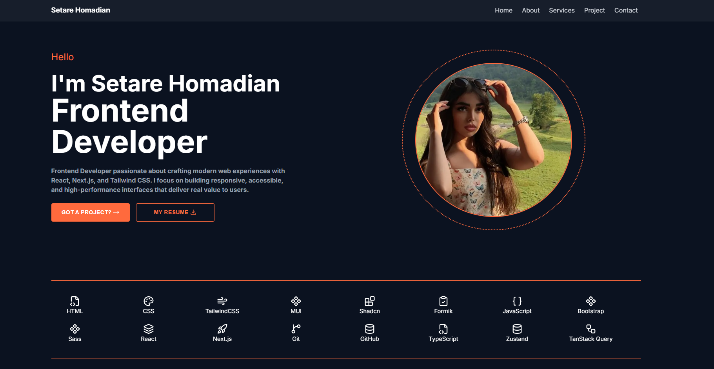
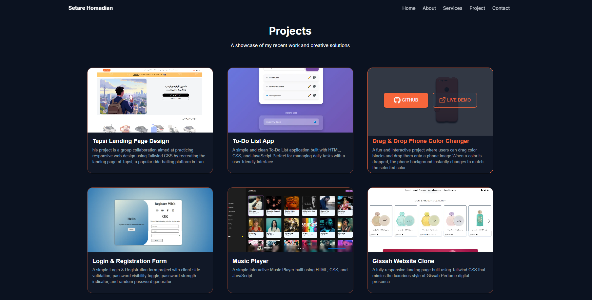

# 🚀 My Portfolio Website

Welcome to my personal portfolio website!  
This project is built to introduce myself, showcase my projects, and demonstrate my skills as a Front-End Developer.

---

## 🌐 Live Demo

👉 **Live Website:**  
[demo link here](https://myportfolio.homadiansetare12.workers.dev)

---

## 📸 Preview

  

---

## ✨ About the Project

This is a modern, fully responsive **portfolio website** designed to present my skills, projects, and contact information in a clean and professional way.

It includes:
- About section introducing myself
- Project showcase section
- Contact form in footer (messages are sent directly to my Gmail)
- Smooth animations and modern UI

---

## 🛠️ Tech Stack

This project is built using:

- ⚛️ Next.js
- ⚛️ React.js
- 🎨 Tailwind CSS
- 🧩 Formik (Form handling)
- 🧱 shadcn/ui (UI Components)
- 🎯 Lucide Icons
- 🎨 MUI (Material UI)
- 🎬 Framer Motion (Animations)

---

## 📱 Responsive Design

- Fully responsive on all devices 📱💻
- Mobile navigation is different from desktop version
- Optimized UI for smooth user experience

---

## 📬 Contact Feature

Users can send messages directly from the contact form in the footer.  
Messages are delivered directly to my Gmail inbox.

---

## 📂 Features

- Modern UI/UX design
- Smooth scroll navigation
- Animated components
- Mobile-friendly navigation menu
- Project showcase section
- Contact form integration

---

## 📬 Contact & Collaboration

I’m always open to collaboration and new opportunities.

If you would like to work together, discuss a project, or just get in touch, you can send me a message directly through the contact form in the footer of my portfolio website.

📨 All messages are automatically sent to my Gmail inbox.

Let’s build something amazing together 🚀
---

## 🧑‍💻 Author

**Setare Homadian**  
Front-End Developer

---

## ⭐ Show Your Support

If you like this project, please give it a ⭐ on GitHub!

---

## 📌 Note

Feel free to fork this project and customize it for your own portfolio.
